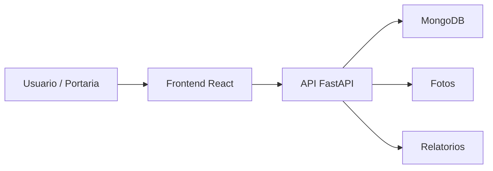

# Controle de Acesso Operacional 2.0

Sistema web para controle operacional de acesso, portaria, visitantes, diretoria, frota, carregamentos, agendamentos, relatorios e fotos de evidencia.

## Visao Geral

O projeto organiza rotinas de controle de acesso em uma aplicacao web composta por frontend React, API FastAPI e banco MongoDB. A versao 2.0 parece evoluir uma versao anterior relacionada, incluindo fluxos de registro, consulta e relatorios.

## Problema Resolvido

O sistema apoia equipes de portaria e operacoes que precisam registrar movimentacoes de pessoas, veiculos e carregamentos, mantendo historico e evidencias para consulta.

## Principais Funcionalidades

### Funcionalidades Disponiveis

- Autenticacao de usuarios.
- Controle de visitantes.
- Controle de funcionarios.
- Controle de diretoria.
- Controle de frota.
- Controle de carregamentos.
- Agendamentos.
- Relatorios.
- Upload e consulta de fotos.
- Painel com indicadores.
- Gestao de usuarios.

### Funcionalidades Em Desenvolvimento

- Melhorias de agendamento, relatorios e upload aparecem nos artefatos do projeto.

### Funcionalidades Planejadas

- Informacao nao confirmada no conteudo atual do repositorio.

## Como Funciona

```text
Usuario acessa o sistema
-> realiza login
-> seleciona modulo de portaria
-> registra entrada, saida, agendamento ou foto
-> a API valida e grava os dados
-> MongoDB armazena os registros
-> relatorios e consultas ficam disponiveis
```

## Tecnologias Utilizadas

- Python
- FastAPI
- MongoDB
- React
- Tailwind CSS
- JWT
- Bcrypt
- jsPDF
- xlsx

## Arquitetura



## Estrutura Do Projeto

- `backend/`: API, autenticacao, rotas, banco e servicos.
- `frontend/`: interface web, paginas, componentes e contexto de autenticacao.
- `memory/` e `test_reports/`: artefatos de acompanhamento existentes no projeto.

## Status

Versao relacionada a um projeto anterior de controle de acesso, aparentemente mais recente. O estado de producao nao esta confirmado no conteudo atual.

## Autor

Desenvolvido por Michele Santana — Kalion Tecnologia

Perfil profissional: https://github.com/Tr3mbolon4
